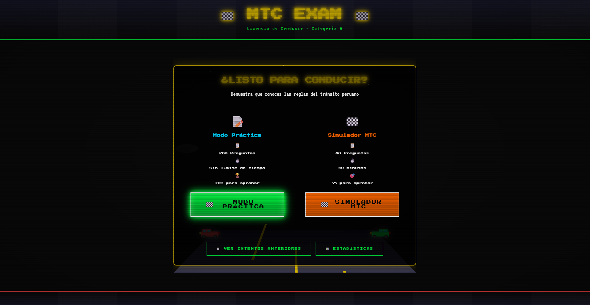
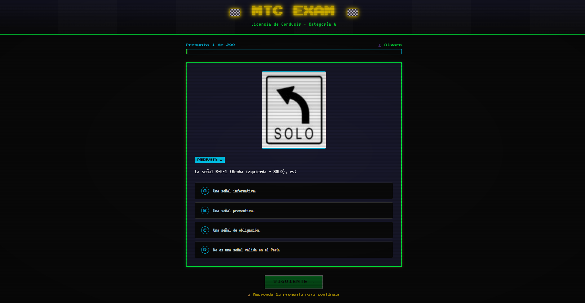
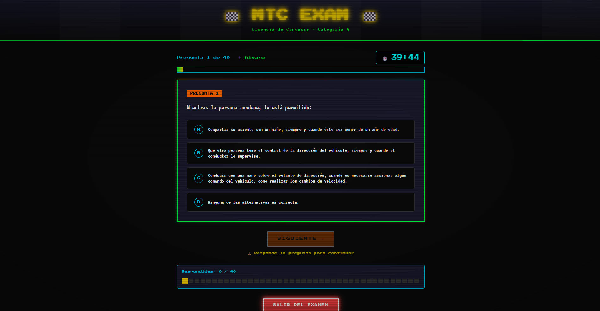
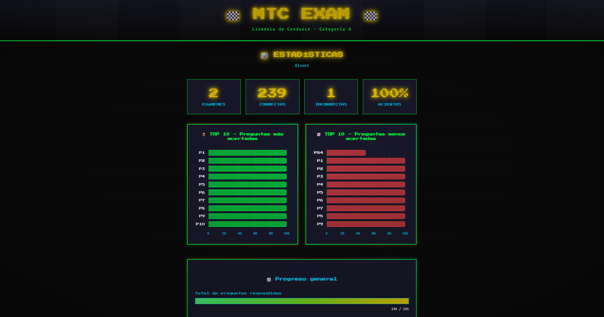
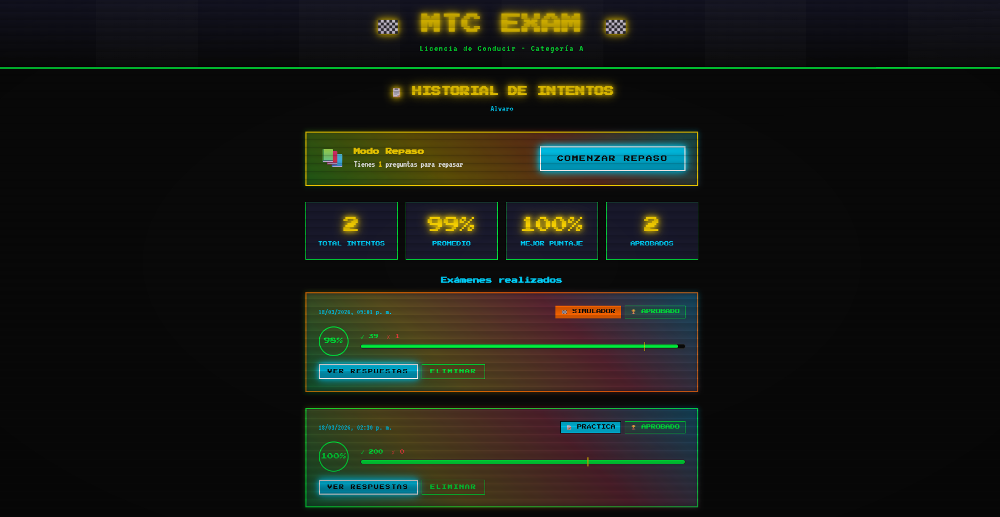

# 🚗 MTC Exam - Simulador de Examen de Licencia de Conducir

<p align="center">
  
</p>

<p align="center">
  <strong>Simulador del examen de reglas de tránsito del Ministerio de Transportes y Comunicaciones (MTC) del Perú</strong>
</p>

<p align="center">
  
  
  
  
</p>

---

## 📋 Tabla de Contenidos

- [Acerca del Proyecto](#acerca-del-proyecto)
- [Características](#características)
- [Modos de Examen](#modos-de-examen)
- [Capturas de Pantalla](#capturas-de-pantalla)
- [Tecnologías Utilizadas](#tecnologías-utilizadas)
- [Estructura del Proyecto](#estructura-del-proyecto)
- [Cómo Usar](#cómo-usar)
- [Criterios de Aprobación](#criterios-de-aprobación)
- [Instalación](#instalación)
- [SEO y Redes Sociales](#seo-y-redes-sociales)
- [Licencia](#licencia)
- [Autor](#autor)

---

## 🎯 Acerca del Proyecto

**MTC Exam** es una aplicación web interactiva diseñada para ayudarte a prepararte para el examen teórico de reglas de tránsito del Ministerio de Transportes y Comunicaciones (MTC) del Perú.

La aplicación simula fielmente las condiciones del examen real, incluyendo:
- Banco de 200 preguntas oficiales del MTC
- Dos modos de estudio: Práctica y Simulador
- Interfaz retro/arcade de los años 90 con efectos CRT
- Estadísticas de progreso y revisión de respuestas

### ¿Para quién es esta aplicación?

- 👨‍🎓 **Estudiantes** que se preparan para obtener su licencia de conducir categoría A
- 📚 **Aspirantes** que quieren aprender las reglas de tránsito peruano
- 🔄 **Repasadores** que necesitan mejorar sus respuestas incorrectas
- 🎮 **Amantes de lo retro** que disfrutan de una experiencia visual única

---

## ✨ Características

### 🏠 Página Principal
- Animación retro de autos en carretera
- Selección clara entre Modo Práctica y Simulador MTC
- Estética arcade de los 90s con efectos CRT y scanlines

### 👤 Sistema de Usuarios
- Ingreso simple de nombre para comenzar
- Datos guardados en localStorage
- Persistencia entre sesiones del navegador

### 📊 Modo Práctica (200 Preguntas)
- 200 preguntas aleatorias de la banca oficial
- Sin límite de tiempo
- Progreso guardado automáticamente
- Navegación por preguntas respondidas
- Revisión de respuestas al finalizar

### 🏁 Simulador MTC (40 Preguntas)
- 40 preguntas aleatorias como el examen real
- Timer de 40 minutos con cuenta regresiva
- Auto-submit cuando el tiempo se agota
- 35 correctas para aprobar (máximo 5 errores)
- Indicador visual del timer con cambios de color:
  - 🟦 Normal: Cyan
  - 🟨 < 5 minutos: Amarillo + pulso lento
  - 🟥 < 1 minuto: Rojo + pulso rápido

### 📈 Sistema de Resultados
- Indicador visual de aprobación (verde/rojo)
- Score circle con porcentaje
- Desglose de respuestas correctas/incorrectas
- Para simulador: muestra "Sin responder"
- Revisión de cada respuesta con colores
- Filtros: Todas / Correctas / Incorrectas

### 📜 Historial de Intentos
- Lista de todos los exámenes realizados
- Badges diferenciados: "PRÁCTICA" vs "SIMULADOR"
- Barra de progreso visual
- Estadísticas resumidas (total, promedio, mejor, aprobados)

### 🔁 Modo Repaso
- Practica solo las preguntas falladas
- Acceso rápido desde historial de intentos
- Progreso guardado automáticamente

### 📉 Estadísticas
- Gráficos de barras con Chart.js
- Top 10 preguntas con mayor tasa de acierto
- Top 10 preguntas con menor tasa de acierto
- Resumen general de progreso

### 🪟 Sistema de Modales
- Alternativa moderna a `alert()` y `confirm()` nativos
- Estilo retro consistente con la app
- Animaciones suaves

### 🔄 Transiciones y Animaciones
- Transiciones de página suaves
- Animación de entrada/salida de preguntas
- Efectos de hover en botones y cards

---

## 🎮 Modos de Examen

### Modo Práctica
<p align="center">
  
</p>

| Característica | Detalle |
|----------------|---------|
| Preguntas | 200 |
| Tiempo | Sin límite |
| Aprobación | 70% (140 correctas) |
| Navegación | Puede saltar entre preguntas |
| Revisión | Inmediata al finalizar |

### Simulador MTC
<p align="center">
  
</p>

| Característica | Detalle |
|----------------|---------|
| Preguntas | 40 |
| Tiempo | 40 minutos |
| Aprobación | 35 correctas (máx. 5 errores) |
| Navegación | Solo hacia adelante |
| Revisión | Inmediata al finalizar |

---

## 📸 Capturas de Pantalla

### Menú Principal
<p align="center">
  
</p>

### Estadísticas
<p align="center">
  
</p>

### Historial de Intentos
<p align="center">
  
</p>

---

## 🛠️ Tecnologías Utilizadas

| Tecnología | Descripción |
|-----------|-------------|
| HTML5 | Lenguaje de marcado base |
| CSS3 | Estilos y animaciones |
| JavaScript (ES6+) | Lógica de la aplicación |
| localStorage | Persistencia de datos |
| Chart.js | Gráficos de estadísticas |
| Google Fonts | Tipografía retro (Press Start 2P, VT323) |
| GitHub Pages | Hosting del sitio |

### Bibliotecas Externas

```html
<!-- Chart.js para estadísticas -->
<script src="https://cdn.jsdelivr.net/npm/chart.js"></script>

<!-- Google Fonts -->
<link href="https://fonts.googleapis.com/css2?family=Press+Start+2P&family=VT323&display=swap" rel="stylesheet">
```

---

## 📁 Estructura del Proyecto

```
mtc-rules-exam-app/
├── index.html                    # Punto de entrada HTML
├── favicon.ico                   # Icono del sitio
├── robots.txt                    # Directivas para crawlers
├── sitemap.xml                   # Mapa del sitio para SEO
├── AGENTS.md                     # Documentación para desarrolladores
├── README.md                     # Este archivo
│
├── css/                         # Estilos
│   ├── main.css                 # Variables CSS, layout base, header/footer
│   ├── components.css           # Botones, cards, inputs, badges
│   ├── animations.css           # Keyframes y animaciones
│   ├── pages.css                # Estilos por página/vista
│   └── modal.css                # Sistema de modales personalizados
│
├── js/                          # JavaScript
│   ├── app.js                   # Punto de entrada
│   ├── router.js                # SPA router con transiciones
│   ├── storage.js               # Gestión de localStorage
│   │
│   ├── data/                    # Datos
│   │   ├── preguntas.json       # 200 preguntas en JSON
│   │   └── questions.js         # Preguntas exportadas en JS
│   │
│   ├── components/              # Componentes reutilizables
│   │   ├── index.js             # Exports
│   │   ├── modal.js             # Sistema de modales
│   │   └── meta.js              # Meta tags dinámicos para SEO
│   │
│   └── views/                   # Vistas de la aplicación
│       ├── index.js             # Exports de vistas
│       ├── home.js              # Página principal
│       ├── name.js              # Ingreso de nombre
│       ├── intro.js             # Reglas del examen
│       ├── exam.js              # Modo práctica (200 preg)
│       ├── simulator-intro.js   # Reglas del simulador
│       ├── simulator.js         # Simulador (40 preg, timer)
│       ├── results.js           # Resultados
│       ├── review.js            # Modo repaso
│       ├── stats.js             # Estadísticas
│       └── attempts.js          # Historial de intentos
│
└── assets/                      # Recursos estáticos
    ├── pregunta_*.png            # Imágenes de preguntas
    ├── menu-start.png           # OG image - Menú principal
    ├── practica-exam.png        # OG image - Modo Práctica
    ├── simulacion-exam.png      # OG image - Simulador
    ├── stats.png                # OG image - Estadísticas
    └── attempts.png              # OG image - Historial
```

---

## 🚀 Cómo Usar

### 1. Ingresa tu Nombre
Al abrir la aplicación, ingresa tu nombre para comenzar tu sesión.

### 2. Elige un Modo de Examen

#### Modo Práctica
- Ideal para aprender y estudiar sin presión
- Puedes navegar entre preguntas
- Sin límite de tiempo
- 70% para aprobar

#### Simulador MTC
- Simula el examen real
- 40 minutos de tiempo límite
- Solo puedes avanzar
- 35 correctas para aprobar (máx. 5 errores)

### 3. Responde las Preguntas
- Selecciona la respuesta correcta
- El botón "Siguiente" se habilita al responder
- En el simulador, las preguntas sin responder cuentan como incorrectas

### 4. Revisa tus Resultados
- Ve tu puntuación y si aprobaste
- Revisa cada pregunta con su respuesta correcta
- Filtra entre correctas e incorrectas

### 5. Mejora tu Progreso
- Usa el Modo Repaso para practicar preguntas falladas
- Revisa tus estadísticas
- Consulta tu historial de intentos

---

## 📊 Criterios de Aprobación

| Modo | Preguntas | Para Aprobar | Errores Permitidos |
|------|-----------|--------------|-------------------|
| Práctica | 200 | ≥ 140 correctas (70%) | Ilimitados |
| Simulador | 40 | ≥ 35 correctas (87.5%) | Máximo 5 |

---

## 💻 Instalación

### Requisitos Previos
- Un navegador moderno (Chrome, Firefox, Safari, Edge)
- Git (opcional)
- Servidor local (opcional, para desarrollo)

### Clonar el Repositorio

```bash
git clone https://github.com/Alvaro-Neyra/MTC-Examen-de-reglas-App.git
cd MTC-Examen-de-reglas-App
```

### Ejecutar Localmente

#### Opción 1: Abrir directamente
Simplemente abre `index.html` en tu navegador.

#### Opción 2: Servidor local (recomendado)

```bash
# Con Python 3
python -m http.server 8000

# Con Node.js
npx serve

# Con PHP
php -S localhost:8000
```

Luego visita `http://localhost:8000` en tu navegador.

### Desplegar en GitHub Pages

1. Sube el proyecto a un repositorio de GitHub
2. Ve a **Settings** > **Pages**
3. Selecciona la rama **main** como fuente
4. Tu sitio estará disponible en `https://tu-usuario.github.io/repo-name`

---

## 🔍 SEO y Redes Sociales

### Meta Tags Optimizados
La aplicación incluye meta tags completos para SEO:

- **Title**: Optimizado con keywords relevantes
- **Description**: Descripción de ~155 caracteres
- **Keywords**: Términos de búsqueda en español
- **Canonical URL**: Para evitar contenido duplicado

### Open Graph (Facebook, LinkedIn)
<p align="center">
  
</p>

Cada página tiene su propia imagen OG:
- 🏠 **Home**: `menu-start.png`
- 📝 **Práctica**: `practica-exam.png`
- 🏁 **Simulador**: `simulacion-exam.png`
- 📊 **Estadísticas**: `stats.png`
- 📋 **Historial**: `attempts.png`

### Twitter Cards
Tarjetas optimizadas para Twitter con imágenes de preview.

### Structured Data (JSON-LD)
- **WebApplication**: Información de la aplicación
- **FAQPage**: Preguntas frecuentes para rich snippets
- **BreadcrumbList**: Migas de pan

### Sitemap XML
Incluye todas las rutas de la aplicación para indexación.

---

## 📄 Licencia

Este proyecto está bajo la licencia MIT. Consulta el archivo [LICENSE](LICENSE) para más detalles.

---

## 👨‍💻 Autor

**Álvaro Neyra**

- GitHub: [@Alvaro-Neyra](https://github.com/Alvaro-Neyra)
- Proyecto: [MTC-Examen-de-reglas-App](https://github.com/Alvaro-Neyra/MTC-Examen-de-reglas-App)

---

## 🙏 Agradecimientos

- **MTC Perú** por proporcionar el banco de preguntas oficiales
- **Google Fonts** por las tipografías retro
- **Chart.js** por la biblioteca de gráficos
- A todos los que contribuirán a mejorar esta aplicación

---

<p align="center">
  <strong>¡Buena suerte con tu examen! 🍀</strong>
</p>

<p align="center">
  <a href="https://github.com/Alvaro-Neyra/MTC-Examen-de-reglas-App">
    
  </a>
</p>
